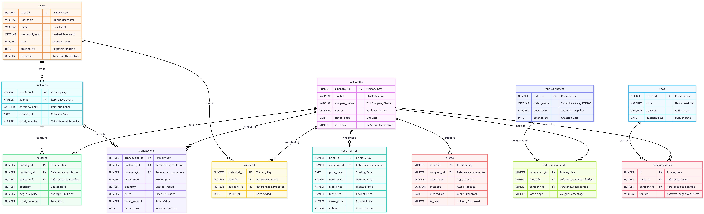

# 🚀 PSX IntelliTrade AI


**Intelligent Stock Portfolio & Market Analytics System for Pakistan Stock Exchange**

PSX IntelliTrade AI is a full-stack, database-driven trading analytics platform that combines Oracle PL/SQL power with a modern React interface and a scalable Node.js API layer. It is designed to model realistic portfolio workflows, market intelligence, governance controls, and financial analytics for PSX-focused decision support.

---

## 1. HEADER

**Project:** PSX IntelliTrade AI  
**Tagline:** Intelligent Stock Portfolio & Market Analytics System for Pakistan Stock Exchange  
**Repository:** https://github.com/Maaz-Ali0102/PSX-IntelliTrade-AI

This repository demonstrates an enterprise-style architecture where business rules are enforced across backend services and Oracle database logic. The result is a practical portfolio management and market intelligence system with authentication, analytics, alerts, watchlists, indices, and admin operations.

---

## 2. TABLE OF CONTENTS

- [1. HEADER](#1-header)
- [2. TABLE OF CONTENTS](#2-table-of-contents)
- [3. OVERVIEW](#3-overview)
- [4. FEATURES](#4-features)
- [5. SYSTEM ARCHITECTURE](#5-system-architecture)
- [6. DATABASE DESIGN](#6-database-design)
- [7. PL/SQL COMPONENTS](#7-plsql-components)
- [8. ANALYTICS & FORMULAS](#8-analytics--formulas)
- [9. API ENDPOINTS](#9-api-endpoints)
- [10. BUSINESS RULES](#10-business-rules)
- [11. DATABASE SETUP](#11-database-setup)
- [12. BACKEND SETUP](#12-backend-setup)
- [13. FRONTEND SETUP](#13-frontend-setup)
- [14. DEFAULT CREDENTIALS](#14-default-credentials)
- [15. PROJECT STRUCTURE](#15-project-structure)
- [16. DATABASE UPDATES (Phase 1 & 2)](#16-database-updates-phase-1--2)
- [17. CHALLENGES FACED](#17-challenges-faced)
- [18. KNOWN LIMITATIONS](#18-known-limitations)
- [19. FUTURE IMPROVEMENTS](#19-future-improvements)
- [20. WHY ORACLE](#20-why-oracle)
- [21. KEY CONCEPTS DEMONSTRATED](#21-key-concepts-demonstrated)
- [22. CONTRIBUTING](#22-contributing)
- [23. LICENSE](#23-license)

---

## 3. OVERVIEW

### What is PSX IntelliTrade AI?
PSX IntelliTrade AI is a role-based investment intelligence platform for Pakistan Stock Exchange data simulation, portfolio execution, and market analytics. It brings together stock discovery, trade execution, risk measurement, and alerting into one integrated workflow.

### Why it was built
- To create a practical Oracle-backed fintech system that goes beyond CRUD and demonstrates serious SQL/PL/SQL capability.
- To centralize portfolio and market analytics in a single system with business-rule integrity.
- To simulate institutional-grade workflows for academic and professional demonstration use.

### Who can use it
- **ADMIN**
  - Oversees platform activity, users, alerts, and transaction monitoring.
  - Triggers system-wide market alert generation.
- **INVESTOR**
  - Manages portfolios, executes buy/sell operations, tracks risk and performance.
  - Uses watchlist, alerts, market indices, and news intelligence.

### What problems it solves
- Fragmented market tracking across multiple disconnected tools.
- Inconsistent portfolio calculations and weak transaction validations.
- Lack of explainable risk scoring and cross-sector market visibility.
- Manual operational work for alerts and user access governance.

### Challenges faced (and how they were solved)
The biggest complexity was not UI; it was maintaining **financial correctness across time-based price data, transactional integrity, and analytics views**. We solved this through carefully designed constraints, trigger logic, and Oracle analytics functions.

| Area | Challenge | Resolution |
|---|---|---|
| Trade Integrity | Keeping holdings accurate after mixed BUY/SELL patterns | Implemented `TRG_UPDATE_HOLDINGS` to auto-reconcile quantity, invested value, and average cost |
| Alert Duplication | Re-running daily alerts created repeated records | Added idempotent checks in `GENERATE_ALERTS` to enforce once-per-day generation |
| Analytics Accuracy | P&L% division errors when investment baseline was zero | Added guarded CASE logic in analytics view to avoid divide-by-zero |
| Performance on Joins | Complex joins across historical prices and portfolios became heavy | Used targeted query design, latest-price extraction logic, and indexed foreign-key access patterns |
| Many-to-Many Modeling | Multiple relationships (watchlist, index composition, news impact) required extensibility | Normalized schema with dedicated junction tables and uniqueness constraints |
| Role-Driven Access | Preventing inactive users and role misuse | Enforced checks in login function plus backend route-level role controls |
| Data Simulation Quality | Needed realistic seed data volume for analytics testing | Generated one-year multi-company price history with Oracle randomization and strict table relations |

---

## 4. FEATURES

### 🔐 Authentication & Security
- User registration with password hashing (RAWTOHEX)
- Secure login via Oracle PL/SQL function (PSX_LOGIN)
- Role-based access control (ADMIN/INVESTOR)
- Protected routes
- Account activation/deactivation by admin

### 📈 Stock Market
- 20 PSX listed companies across 6 sectors
- 21,900 rows simulated 365-day price history
- Real-time stock price display
- Stock search and sector filtering
- Individual stock detail with 7D/30D/90D/365D charts
- Stock comparison (up to 3 stocks)
- Add stocks to personal watchlist with notes

### 💼 Portfolio Management
- Multiple portfolios per user
- Buy/Sell with validation:
  - Cannot sell more than owned
  - Price cannot be zero
  - Quantity cannot be zero
- Auto holdings update via Oracle Trigger
- Duplicate portfolio name prevention
- Portfolio summary (Total Value, P&L, Risk Score)
- Portfolio growth chart (30 days)

### 📊 Analytics & Intelligence
- Volatility-based risk scoring (STDDEV)
- Top gainers/losers ranking (RANK function)
- Sector performance analysis
- Price spike/drop alerts (>5% change)
- Market summary dashboard

### 👀 Watchlist
- Add stocks to personal watchlist
- Add notes to watched stocks
- Remove stocks from watchlist
- View current price and change% for watched stocks

### 📰 Market News
- 10 PSX market news articles
- Filter by category (Market/Sector/Economy/Regulatory)
- News linked to affected companies
- Impact tracking (POSITIVE/NEUTRAL/NEGATIVE)

### 📉 Market Indices
- KSE-5 (Top 5 companies)
- KSE-10 (Top 10 companies)
- KSE All Share (All 20 companies)
- Weightage percentage per company
- Live price and change% per index component

### 🔔 Alerts System
- Dedicated alerts page
- Filter by PRICE SPIKE/PRICE DROP
- Mark alerts as read
- Unread count badge

### 👑 Admin Panel
- System statistics (Users, Portfolios, Transactions, Alerts)
- User management (activate/deactivate)
- Role management (make admin)
- Generate market alerts (Oracle procedure)
- View all transactions

### 📋 Transaction History
- Complete buy/sell history per user
- Filter by BUY/SELL
- Total transaction count

---

## 5. SYSTEM ARCHITECTURE

PSX IntelliTrade AI follows a three-tier architecture with clear separation of concerns.

```text
React 18 Frontend (Port 3000)
        |
        | HTTP / JSON (Axios)
        v
Node.js + Express API (Port 5000)
        |
        | Oracle DB Driver
        v
Oracle Database 21c XE (localhost:1521/XEPDB1)
```

### Layer Responsibilities

| Layer | Responsibilities |
|---|---|
| Frontend | Authentication flow, protected routing, dashboards, analytics visualization, and user interactions |
| Backend | API orchestration, validation, business rule checks, role-aware operations, and DB integration |
| Database | Persistence, constraints, PL/SQL procedures/functions, triggers, analytic views, and transactional consistency |

---

## 6. DATABASE DESIGN



### Tables

| # | Table | Description | Key Columns |
|---|-------|-------------|-------------|
| 1 | COMPANIES | PSX listed companies | company_id PK, symbol UK, sector |
| 2 | STOCK_PRICES | Daily price history | price_id PK, company_id FK, open/high/low/close |
| 3 | USERS | System users | user_id PK, username UK, role, is_active |
| 4 | PORTFOLIOS | User portfolios | portfolio_id PK, user_id FK, portfolio_name |
| 5 | HOLDINGS | Current holdings | holding_id PK, portfolio_id FK, quantity |
| 6 | TRANSACTIONS | Buy/Sell history | transaction_id PK, trans_type, quantity, price |
| 7 | ALERTS | Market alerts | alert_id PK, alert_type, is_read |
| 8 | WATCHLIST | User watchlists | watchlist_id PK, user_id FK, company_id FK |
| 9 | MARKET_INDICES | PSX indices | index_id PK, index_name, base_value |
| 10 | INDEX_COMPONENTS | Index compositions | component_id PK, weightage |
| 11 | NEWS | Market news | news_id PK, title, source, category |
| 12 | COMPANY_NEWS | News-Company links | cn_id PK, impact |

### Views

| View | Purpose | Functions Used |
|------|---------|----------------|
| PORTFOLIO_ANALYTICS | P&L calculations | RANK(), arithmetic |
| STOCK_RISK | Volatility scoring | STDDEV(), AVG() |
| TOP_GAINERS_LOSERS | Daily rankings | RANK(), LAG() |

### Many-to-Many Relationships

| # | Relationship | Junction Table | Extra Attributes |
|---|-------------|----------------|-----------------|
| 1 | USERS ↔ COMPANIES | WATCHLIST | added_date, notes |
| 2 | MARKET_INDICES ↔ COMPANIES | INDEX_COMPONENTS | weightage |
| 3 | NEWS ↔ COMPANIES | COMPANY_NEWS | impact |

---

## 7. PL/SQL COMPONENTS

### Stored Procedures

| Procedure | Parameters | Description |
|-----------|-----------|-------------|
| REGISTER_USER | username, email, password, role | Hashes password, inserts user |
| GENERATE_ALERTS | none | Checks daily alerts, inserts spike/drop |

### Functions

| Function | Returns | Description |
|----------|---------|-------------|
| PSX_LOGIN | VARCHAR2 | Verifies password, returns SUCCESS:ROLE |

### Triggers

| Trigger | Event | Description |
|---------|-------|-------------|
| TRG_UPDATE_HOLDINGS | AFTER INSERT ON TRANSACTIONS | Auto updates holdings on buy/sell |

### Sequences (12 total)

```text
seq_company_id, seq_price_id, seq_user_id,
seq_portfolio_id, seq_holding_id, seq_transaction_id,
seq_alert_id, seq_watchlist_id, seq_market_index_id,
seq_component_id, seq_news_id, seq_company_news_id
```

---

## 8. ANALYTICS & FORMULAS

| Formula | Calculation | Used In |
|---------|-------------|---------|
| Risk Score | STDDEV(close_price) over 365 days | stock_risk view |
| Portfolio Value | quantity × current_price | portfolio_analytics |
| Profit/Loss | current_value - total_invested | portfolio_analytics |
| P&L % | (P&L / total_invested) × 100 | portfolio_analytics |
| Avg Buy Price | total_invested / quantity | trigger |
| Price Change % | (today - yesterday) / yesterday × 100 | top_gainers_losers |
| Alert Trigger | change% > +5% or < -5% | generate_alerts |

### Risk Levels

| Level | Condition |
|-------|-----------|
| HIGH RISK | STDDEV > 15 |
| MEDIUM RISK | STDDEV > 8 |
| LOW RISK | STDDEV ≤ 8 |

---

## 9. API ENDPOINTS

> Total: **40+ REST API endpoints** across all modules (including list/detail/filter/action routes).

### Auth Endpoints

| Method | Endpoint | Description |
|---|---|---|
| POST | /api/auth/register | Register new user |
| POST | /api/auth/login | Authenticate and return role/session details |
| GET | /api/auth/user/:username | Get user profile summary |

### Stock Endpoints

| Method | Endpoint | Description |
|---|---|---|
| GET | /api/stocks | List stocks with latest price context |
| GET | /api/stocks/:symbol/detail | Get stock detail |
| GET | /api/stocks/:symbol/history | Get historical prices |
| GET | /api/stocks/gainers | Top gainers |
| GET | /api/stocks/losers | Top losers |
| GET | /api/stocks/risk | Risk-ranked stock list |

### Portfolio Endpoints

| Method | Endpoint | Description |
|---|---|---|
| POST | /api/portfolio/create | Create portfolio |
| GET | /api/portfolio/:user_id | List user portfolios |
| GET | /api/portfolio/:portfolio_id/holdings | Get holdings |
| GET | /api/portfolio/:portfolio_id/summary | Portfolio summary |
| GET | /api/portfolio/:portfolio_id/risk | Portfolio risk profile |
| GET | /api/portfolio/:portfolio_id/growth | 30-day growth data |
| GET | /api/portfolio/:user_id/transactions | User transaction history |
| POST | /api/portfolio/buy | Execute buy order |
| POST | /api/portfolio/sell | Execute sell order |

### Analytics Endpoints

| Method | Endpoint | Description |
|---|---|---|
| GET | /api/analytics/market | Market summary |
| GET | /api/analytics/sectors | Sector performance |
| GET | /api/analytics/alerts | List alerts |
| PUT | /api/analytics/alerts/:id/read | Mark alert as read |
| GET | /api/analytics/risk/:portfolio_id | Portfolio risk analytics |

### Watchlist Endpoints

| Method | Endpoint | Description |
|---|---|---|
| GET | /api/watchlist/:user_id | Get user watchlist |
| POST | /api/watchlist/add | Add stock to watchlist |
| DELETE | /api/watchlist/remove | Remove stock from watchlist |

### Market Indices Endpoints

| Method | Endpoint | Description |
|---|---|---|
| GET | /api/indices | List all indices |
| GET | /api/indices/:index_id/stocks | Get index components and metrics |

### News Endpoints

| Method | Endpoint | Description |
|---|---|---|
| GET | /api/news | Get all news |
| GET | /api/news/latest | Get latest news |
| GET | /api/news/:news_id | Get single news item with linked companies |
| GET | /api/news/company/:company_id | Get company-specific news |

### Admin Endpoints

| Method | Endpoint | Description |
|---|---|---|
| GET | /api/admin/stats | System KPIs |
| GET | /api/admin/users | List all users |
| GET | /api/admin/transactions | List all transactions |
| POST | /api/admin/generate-alerts | Run daily alert generation |
| PUT | /api/admin/users/:id/role | Update role |
| PUT | /api/admin/users/:id/deactivate | Deactivate account |
| PUT | /api/admin/users/:id/activate | Activate account |

---

## 10. BUSINESS RULES

| # | Rule | Enforcement |
|---|------|-------------|
| 1 | Role must be ADMIN or INVESTOR | DB DEFAULT + Backend |
| 2 | Cannot sell more shares than owned | Backend validation |
| 3 | Price cannot be zero | Backend validation |
| 4 | Quantity cannot be zero | Backend validation |
| 5 | Duplicate portfolio name per user | UNIQUE constraint |
| 6 | User must be active to login | PSX_LOGIN function |
| 7 | One watchlist entry per stock | UNIQUE constraint |
| 8 | Daily alerts generated once | GENERATE_ALERTS check |
| 9 | Index component unique per index | UNIQUE constraint |
| 10 | News company link unique | UNIQUE constraint |

---

## 11. DATABASE SETUP

### Step 1: Install and Start Oracle 21c XE
- Ensure Oracle listener and database services are running.
- Use service: `XEPDB1`.

### Step 2: Create Project User

```sql
ALTER SESSION SET CONTAINER = XEPDB1;

CREATE USER psx_user IDENTIFIED BY psx123;
GRANT CONNECT, RESOURCE TO psx_user;
GRANT CREATE VIEW, CREATE PROCEDURE, CREATE TRIGGER, CREATE SEQUENCE TO psx_user;
GRANT UNLIMITED TABLESPACE TO psx_user;
```

### Step 3: Connect in Oracle SQL Developer
- Host: `localhost`
- Port: `1521`
- Service Name: `XEPDB1`
- Username: `psx_user`
- Password: `psx123`

### Step 4: Execute SQL Scripts in Order

```text
database/01_tables.sql
database/02_sequences.sql
database/03_seed_data.sql
database/04_auth_procedures.sql
database/05_triggers.sql
database/06_analytics.sql
database/07_alerts.sql
database/08_watchlist.sql
database/09_market_indices.sql
database/10_news.sql
database/11_seed_new_data.sql
```

### Step 5: Verify Objects

```sql
SELECT COUNT(*) FROM companies;
SELECT COUNT(*) FROM stock_prices;
SELECT COUNT(*) FROM users;
SELECT object_name, object_type
FROM user_objects
WHERE object_type IN ('TABLE', 'VIEW', 'PROCEDURE', 'FUNCTION', 'TRIGGER')
ORDER BY object_type, object_name;
```

---

## 12. BACKEND SETUP

### Step 1: Install Dependencies

```bash
cd backend
npm install
```

### Step 2: Configure Environment
Create `.env` in `backend`:

```env
DB_USER=psx_user
DB_PASSWORD=psx123
DB_HOST=localhost
DB_PORT=1521
DB_SERVICE=XEPDB1
PORT=5000
```

### Step 3: Run Backend Server

```bash
node server.js
```

### Step 4: Health Check

```bash
curl http://localhost:5000/api/stocks
```

---

## 13. FRONTEND SETUP

### Step 1: Install Dependencies

```bash
cd frontend
npm install
```

### Step 2: Run React App

```bash
npm start
```

### Step 3: Access Application
- Frontend: `http://localhost:3000`
- Backend API: `http://localhost:5000`

### Step 4: Verify Role-Based Access
- Login as Admin and verify admin routes.
- Login as Investor and verify portfolio/watchlist features.

---

## 14. DEFAULT CREDENTIALS

| Username | Password | Role |
|----------|----------|------|
| admin | admin123 | ADMIN |
| ali_investor | ali123 | INVESTOR |
| sara_investor | sara123 | INVESTOR |

---

## 15. PROJECT STRUCTURE

```text
PSX IntelliTrade AI/
├── README.md
├── backend/
│   ├── db.js
│   ├── package.json
│   ├── server.js
│   └── routes/
│       ├── admin.js
│       ├── analytics.js
│       ├── auth.js
│       ├── indices.js
│       ├── news.js
│       ├── portfolio.js
│       ├── stocks.js
│       └── watchlist.js
├── database/
│   ├── 01_tables.sql
│   ├── 02_sequences.sql
│   ├── 03_seed_data.sql
│   ├── 04_auth_procedures.sql
│   ├── 05_triggers.sql
│   ├── 06_analytics.sql
│   ├── 07_alerts.sql
│   ├── 08_watchlist.sql
│   ├── 09_market_indices.sql
│   ├── 10_news.sql
│   └── 11_seed_new_data.sql
└── frontend/
    ├── package.json
    ├── README.md
    ├── build/
    │   ├── asset-manifest.json
    │   ├── index.html
    │   ├── manifest.json
    │   ├── robots.txt
    │   └── static/
    │       ├── css/
    │       └── js/
    ├── public/
    │   ├── index.html
    │   ├── manifest.json
    │   └── robots.txt
    └── src/
        ├── App.css
        ├── App.js
        ├── App.test.js
        ├── index.css
        ├── index.js
        ├── reportWebVitals.js
        ├── setupTests.js
        ├── components/
        ├── pages/
        │   ├── Admin.js
        │   ├── Alerts.js
        │   ├── Analytics.js
        │   ├── Dashboard.js
        │   ├── Login.js
        │   ├── MarketIndices.js
        │   ├── News.js
        │   ├── Portfolio.js
        │   ├── Register.js
        │   ├── Stocks.js
        │   ├── Transactions.js
        │   └── Watchlist.js
        └── services/
            └── api.js
```

---

## 16. DATABASE UPDATES (Phase 1 & 2)

| Phase | Update | Impact |
|---|---|---|
| Phase 1 | Core schema created (companies, prices, users, portfolios, holdings, transactions, alerts) | Established transactional and analytics baseline |
| Phase 1 | `PSX_LOGIN` and `REGISTER_USER` logic added | Centralized authentication at database layer |
| Phase 1 | `TRG_UPDATE_HOLDINGS` trigger implemented | Automated holdings consistency after each trade |
| Phase 1 | Analytics views (`portfolio_analytics`, `stock_risk`, `top_gainers_losers`) added | Enabled KPI dashboards and risk scoring |
| Phase 1 | `GENERATE_ALERTS` procedure introduced | Automated market movement alert generation |
| Phase 2 | Watchlist module (`WATCHLIST`) added | Personalized investor tracking with notes |
| Phase 2 | Index module (`MARKET_INDICES`, `INDEX_COMPONENTS`) added | Broader market benchmarking and component analytics |
| Phase 2 | News module (`NEWS`, `COMPANY_NEWS`) added | Integrated qualitative market intelligence |
| Phase 2 | Guard clauses for P&L division and duplicate alerts refined | Improved correctness and operational stability |

---

## 17. CHALLENGES FACED

| # | Challenge | Why it was difficult | Solution implemented |
|---|---|---|---|
| 1 | Maintaining holdings correctness over sequential buy/sell events | Weighted averages and investment basis change with each transaction | Trigger-based recalculation with deterministic buy/sell branches |
| 2 | Ensuring analytics stayed accurate on sparse or edge-case data | Zero-investment and missing-day scenarios can break percentages/rankings | CASE-based safeguards and strict latest-price selection logic |
| 3 | Preventing duplicate operational alerts | Admins may trigger alert generation multiple times per day | Idempotent procedure checks with same-day guard conditions |
| 4 | Scaling join-heavy analytics against growing historical data | Portfolio, prices, and rankings require multi-table computations | Normalized schema + optimized query patterns + FK-based access |
| 5 | Modeling multiple many-to-many business domains cleanly | Watchlists, index composition, and news impact all required metadata | Dedicated junction tables with uniqueness constraints |
| 6 | Synchronizing DB business logic with backend validation | Rules must align to avoid contradictory outcomes | Mirrored enforcement: DB constraints + backend guardrails |
| 7 | Role and account-state security in login flow | Inactive or unauthorized users needed strict handling | Login function role return pattern and active-status verification |
| 8 | Building realistic seed data for meaningful analytics | Low-volume data cannot validate volatility and ranking math | Generated 365-day history for all companies to stress analytics paths |

---

## 18. KNOWN LIMITATIONS

- Simulated market data is static and not connected to a live PSX feed.
- LocalStorage-based session state is suitable for demo scope, not enterprise SSO.
- No distributed job scheduler for timed daily alert generation.
- Limited automated test coverage across all API edge cases.
- No asynchronous queueing for high-throughput trade ingestion.
- Deployment guidance is local-first; production hardening is not fully scripted.

---

## 19. FUTURE IMPROVEMENTS

- Integrate live PSX market data ingestion pipeline.
- Introduce JWT + refresh-token based secure auth model.
- Add audit logs for sensitive admin actions.
- Implement CI/CD pipeline with lint, test, and migration checks.
- Add notification channels (email/SMS/push) for alerts.
- Add predictive analytics module for trend modeling.
- Add portfolio optimization suggestions based on risk appetite.
- Add role-specific reporting exports (PDF/CSV).

---

## 20. WHY ORACLE

Oracle was chosen because the project relies heavily on **data integrity, transactional consistency, and advanced analytics at the database layer**. Features such as PL/SQL procedures/functions, robust trigger support, analytic functions (`RANK`, `LAG`, `STDDEV`), and predictable enterprise-grade SQL behavior make Oracle a strong fit for a finance-oriented platform where correctness and governance are as important as UI experience.

---

## 21. KEY CONCEPTS DEMONSTRATED

| Concept | Demonstrated In |
|---|---|
| Relational Data Modeling | Core tables, foreign keys, and normalized many-to-many design |
| PL/SQL Business Logic | `REGISTER_USER`, `PSX_LOGIN`, `GENERATE_ALERTS` |
| Trigger-Driven Consistency | `TRG_UPDATE_HOLDINGS` |
| Advanced SQL Analytics | Risk scoring, gainers/losers, portfolio P&L views |
| REST API Design | Modular route structure with role-aware operations |
| Frontend Data Visualization | Recharts-based trend, risk, and portfolio dashboards |
| Access Control | ADMIN/INVESTOR feature segmentation |
| Full-Stack Integration | React + Express + Oracle end-to-end workflow |

---

## 22. CONTRIBUTING

Contributions are welcome and appreciated.

1. Fork the repository.
2. Create a new branch: `feature/your-feature-name`.
3. Keep commits focused and descriptive.
4. Add validation notes or tests for behavioral changes.
5. Open a pull request with:
   - Problem statement
   - Approach summary
   - Screenshots or API samples (if relevant)
   - Any migration/setup notes

Please ensure your changes preserve existing business rules and do not break database object dependencies.

---

## 23. LICENSE

This project is licensed under the **MIT License**.  
See the LICENSE file for complete terms.
